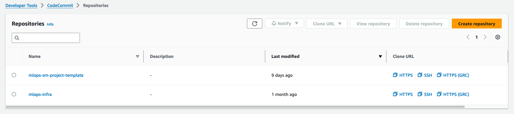
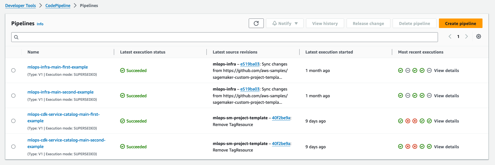
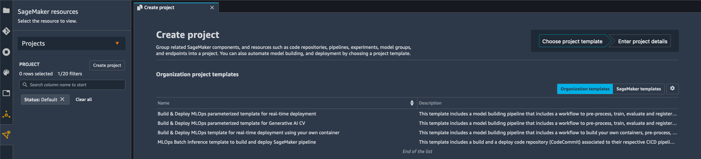
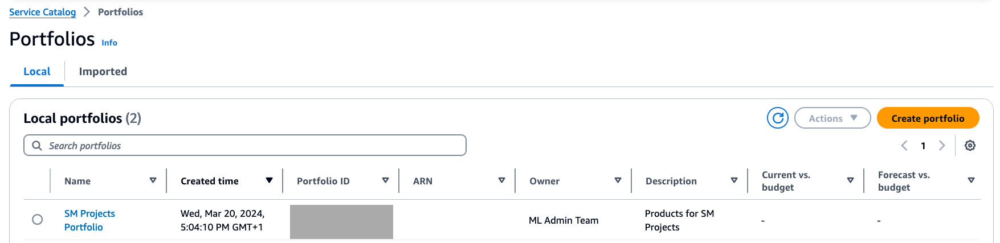

# MLOps Multi Account Setup with AWS CDK

As enterprise businesses embrace Machine Learning (ML) across their organisations, manual workflows for building, training, and deploying ML models tend to become bottlenecks to innovation. To overcome this, enterprises needs to shape a clear operating model defining how multiple personas, such as Data Scientists, Data Engineers, ML Engineers, IT, and Business stakeholders, should collaborate and interact, how to separate the concerns, responsibilities and skills, and how to leverage AWS services optimally. This combination of ML and Operations, so-called MLOps, is helping companies streamline their end-to-end ML lifecycle and boost productivity of data scientists while maintaining high model accuracy and enhancing security and compliance.

In this repository, we have created a baseline infrastructure for a secure MLOps environment based on CDK. Our solution consists of two parts:

 - [mlops-infra](mlops-multi-account-cdk/mlops-infra/): The necessary secure infrastructure for the multiple accounts of MLOps including VPCs and VPC endpoints, SSM, IAM user roles, etc.

 - [mlops-sm-project-template](mlops-multi-account-cdk/mlops-sm-project-template/): A Service Catalog portfolio that contains custom Amazon SageMaker Project templates that enable multi account model promotion.

## How to use:

First deploy [mlops-infra](mlops-multi-account-cdk/mlops-infra/):

[mlops-infra](mlops-multi-account-cdk/mlops-infra/) will deploy a Secure data science exploration environment for your data scientists to explore and train their models inside a SageMaker studio environment.
It also prepares your dev/preprod/prod accounts with the networking setup to: either run SageMaker studio in a VPC, or be able to create SageMaker Endpoints and other infrastructure inside VPCs.
Please note that the networking created by mlops_infra is a kick start example and that the repository is also designed to be able to import existing VPCs created by your organization instead of creating its own VPCs.
The repository will also create example SageMaker users (Lead Data Scientist and Data Scientist) and associated roles and policies.

Once you have deployed [mlops-infra](mlops-multi-account-cdk/mlops-infra/), deploy [mlops-sm-project-template](mlops-multi-account-cdk/mlops-sm-project-template/):

[mlops-sm-project-template](mlops-multi-account-cdk/mlops-sm-project-template/) will create a Service Catalog portfolio that contains SageMaker project templates as Service Catalog products.
To do so, the [service_catalog](mlops-multi-account-cdk/mlops-sm-project-template/mlops_sm_project_template/service_catalog_stack.py) stack iterates over the [templates](mlops-multi-account-cdk/mlops-sm-project-template/mlops_sm_project_template/templates) folder which contains your different organization SageMaker project templates in the form of CDK stacks.
The general idea of what those templates create is explained in [mlops-sm-project-template README](mlops-multi-account-cdk/mlops-sm-project-template/README.md) and in this [SageMaker Projects general architecture diagram](mlops-sm-project-template/diagrams/mlops-sm-project-general-architecture.jpg)
These example SageMaker project templates can be customized for the need of your organization.

**Note:** Both of those folders are cdk applications which also come with their respective CICD pipelines hosted in a central governance account, to deploy and maintain the infrastructure they define to target accounts. This is why you will see that both also contain a `pipeline_stack` and a `codecommit_stack`.
However if you are not interested in the concept of a centralized governance account and CICD mechanism, or if you already have an internal mechanism in place for those ([AWS Control Tower](https://docs.aws.amazon.com/controltower/index.html), [ADF](https://github.com/awslabs/aws-deployment-framework), etc...), you can simply use the `CoreStage` of each of those CDK applications. See the READMEs of each subfolder for more details.

## Quick setup - first deployment:

The very first time you deploy the repository, you will be deploying both [mlops-infra](mlops-multi-account-cdk/mlops-infra/app.py) and [mlops-sm-project-template](mlops-multi-account-cdk/mlops-sm-project-template/app.py) cdk applications from your local machine to your AWS governance account.
The minimum pre-requisite is 4 AWS accounts: one governance account (where the central code repositories and CICD pipelines will be hosted), and one business unit composed of three accounts dev/preprod/prod.
To get started we recommend leveraging the helper scripts in [scripts](mlops-multi-account-cdk/scripts) which will help you installing prerequisites on your machine, create the appropriate config files, and bootstrap your AWS accounts.
If you would rather do those actions manually skip the section below and refer to the instructions in [mlops-infra](mlops-multi-account-cdk/mlops-infra/README.md) and [mlops-sm-project-template](mlops-multi-account-cdk/mlops-sm-project-template/README.md).

### First step: Setup AWS Profiles

As the MLOps foundation is based on multiple accounts, it is necessary to create a simple way to interact with multiple AWS credentials. We recommend the creation of an AWS profile per account with enough permission to deploy to CloudFormation following the instructions [here](https://docs.aws.amazon.com/toolkit-for-visual-studio/latest/user-guide/keys-profiles-credentials.html#adding-a-profile-to-the-aws-credentials-profile-file) . For example, the `.aws/credentials` should look like:

```
[mlops-governance]
aws_access_key_id = YOUR_ACCESS_KEY_ID
aws_secret_access_key = YOUR_SECRET_ACCESS_KEY
aws_session_token = YOUR_SESSION_TOKEN  # this token is generated if you are using an IAM Role to assume into the account

[mlops-dev1]
aws_access_key_id = YOUR_ACCESS_KEY_ID
aws_secret_access_key = YOUR_SECRET_ACCESS_KEY
aws_session_token = YOUR_SESSION_TOKEN  # this token is generated if you are using an IAM Role to assume into the account

[mlops-preprod1]
...

[mlops-prod1]
...
```

### Second step: install prerequisites

```bash
mlops-multi-account-cdk/scripts/quick-start.sh prerequisites
```

### Third step: create config files

```bash
mlops-multi-account-cdk/scripts/quick-start.sh config
```

This will create for you the required governance account and business unit config files in both [mlops-infra](mlops-multi-account-cdk/mlops-infra/config/) and [mlops-sm-project-template](mlops-multi-account-cdk/mlops-sm-project-template/config/)
It will also generate a temporary config file `bootstrap_conf.tmp`  that will be used to bootstrap the different accounts.
Please note, the prompt will ask you for an AWS profile for each account. This should correspond to what you defined in the first step "Setup AWS Profiles".

The script will request the at least 4 accounts, i.e. governance, and one business-unit composed of dev, preprod and prod, and the corresponding AWS profiles as inputs. If you want to only deploy to 1 account you can use the same id for all account variables or pass the same values in the script.

### Fourth step: boostrap the accounts

```bash
mlops-multi-account-cdk/scripts/quick-start.sh bootstrap
```

### Fifth step: cdk deploy

```bash
cd mlops-multi-account-cdk/mlops-infra/
pip install -r requirements.txt
cdk deploy --all --profile mlops-governance
```

```bash
cd mlops-multi-account-cdk/mlops-sm-project-template/
pip install -r requirements.txt
cdk deploy --all --profile mlops-governance
```

### Sixth step: customization and maintenance

If you've succesfully deployed both `mlops-infra` and `mlops-sm-project-template`, you should see two CodeCommit repositories created in your governance account.
To customize their content clone these repositories (from now on you can ignore the aws-entreprise-mlops-framework repository).
Any push to the main branch of these repositories will trigger the associated CICD pipelines in your AWS governance account and propagate the changes to your business units.

Inside your AWS governance account you should see something like this:



If the CICD Pipelines (AWS CodePipelines) inside your AWS governance ran succesfully, inside your dev account(s), you should see something like this:

Inside SageMaker Studio:


Or in Service Catalog:


For how to customize, follow the instructions from [mlops-infra/DEVELOPER_GUIDE](mlops-multi-account-cdk/mlops-infra/DEVELOPER_GUIDE.md) and [mlops-sm-project-template/DEVELOPER_GUIDE](mlops-multi-account-cdk/mlops-sm-project-template/DEVELOPER_GUIDE.md).

## Contacts

If you have any comments or questions, please contact:

The maintaining Team:

Viktor Malesevic <malesv@amazon.de>

Fotinos Kyriakides <kyriakf@amazon.com>

Ravi Bhushan Ratnakar <ravibrat@amazon.de>

Marco Geiger <marcogei@amazon.com>

Omar Shouman <omsho@amazon.de>

Sokratis Kartakis <kartakis@amazon.com>

Georgios Schinas <schinasg@amazon.co.uk>

# Special thanks

Fatema Alkhanaizi, who is no longer at AWS but has been the major initial contributor of the project.
